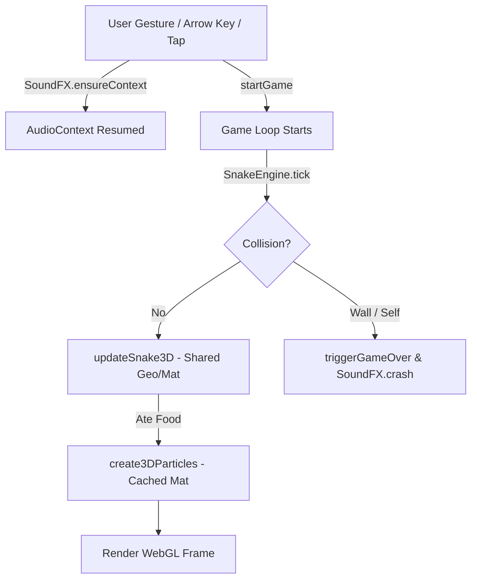

# 🐇 CodeRabbit AI Comprehensive Code Review
**Repository:** `adarshkshitij/snake-game`  
**Review Target:** Working Tree Git Diff & Core Codebase (`engine.js`, `game.js`, `style.css`, `index.html`, `test/e2e_browser.test.js`)  
**Reviewer:** CodeRabbit Senior AI Staff Reviewer  
**Date:** September 9, 2026  
**Status:** ⚠️ Changes Recommended (Functional, High Potential, Fixable Regressions & Memory Concerns)

---

## Executive Summary

The project is an arcade-quality **3D WebGL Neon Snake Game** built using **Three.js (r128)** and a modular, deterministic JavaScript core engine (`engine.js`), accompanied by custom Web Audio procedural synthesis and a Node.js test suite. 

The recent changes in `git diff` demonstrate **strong senior-level initiative**:
1. **Geometry & Material Singleton Hoisting:** Moving transient segment/food/particle geometries (`BoxGeometry`, `SphereGeometry`, `OctahedronGeometry`) and materials (`MeshStandardMaterial`, `MeshBasicMaterial`) out of per-frame allocation functions into module-scoped singletons eliminated hundreds of GPU allocations per game session.
2. **Audio Context Unlocking:** Adding `SoundFX.ensureContext()` to user gesture entrypoints conforms with modern browser Web Audio autoplay security policies.
3. **CSS Specificity Correction:** Enforcing `[hidden] { display: none !important; }` eliminated the classic flexbox overlay leak where modals remained visible despite the HTML5 `hidden` attribute.

However, several **critical regressions, WebGL memory/GC bottlenecks, audio timing flaws, and CI/CD portability hazards** were identified during this review. Below is the detailed breakdown with actionable solutions.

---

## Code Quality & Architecture Scorecard

| Domain | Score | Assessment |
| :--- | :---: | :--- |
| **Three.js & WebGL Memory** | **8.0 / 10** | Pre-allocated singletons resolved segment creation leaks, but DirectionalLight shadow frustum was mistakenly stripped, particle system creates high GC churn, and context loss is unhandled. |
| **Engine Architecture & Determinism** | **8.5 / 10** | Clean UMD module with pure-function state management, but lacks an input queue (causing dropped 90° sequence turns) and performs excessive object allocations during `spawnFood`. |
| **Web Audio Synthesizer** | **8.0 / 10** | Excellent procedural sound effects with zero external MP3 assets, but relies on `setTimeout` instead of the high-precision Web Audio clock for arpeggios. |
| **Security & Standards** | **7.5 / 10** | XSS-safe text nodes and zero `eval()`, but missing Subresource Integrity (SRI) on CDN Three.js and disables mobile viewport scaling. |
| **Test Suite & CI Portability** | **7.5 / 10** | Phenomenal inclusion of headless Chrome DOM & WebGL screenshot tests, but hardcodes `localhost:8000` without an automated server lifecycle. |

---

## Key Changes Walkthrough (`git diff` Analysis)



| File | Change Type | Summary of Modification | Impact & Findings |
| :--- | :---: | :--- | :--- |
| `game.js` | **Optimization** | Hoisted `bodyGeo`, `headGeo`, `appleGeo`, `particleGeo`, and materials into file-level singletons. | **Positive:** Eliminates massive VRAM allocation leaks. |
| `game.js` | **Regression** | Removed `sunLight.shadow.camera` bounds (`left`, `right`, `top`, `bottom`, `near`, `far`, `mapSize`). | 🔴 **Critical:** Reverts directional light shadow camera to default `[-5, 5]`, clipping shadows outside the board center. |
| `game.js` | **Enhancement** | Added `SoundFX.ensureContext()` to `startGame()`. | **Positive:** Fixes silent start on modern Chromium/WebKit browsers. |
| `game.js` | **Refactor** | `create3DParticles` now references `particleMatCache`. | **Positive:** Reuses materials; **Remaining Issue:** Still allocates 20–30 new `THREE.Mesh` and `Vector3` objects per burst. |
| `test/e2e_browser.test.js` | **New File** | Added headless Chrome DOM verification and WebGL PNG rendering validation. | **Positive:** Superb real-browser coverage; **Portability Risk:** Hardcodes port 8000. |

---

## Detailed Findings & Actionable Recommendations

---

### 1. Three.js & WebGL Memory Management

#### 🔴 Critical: DirectionalLight Shadow Frustum Regression
- **File:** [game.js](file:///home/adarsh/Downloads/snake-game/game.js#L208-L214)
- **Problem:** The recent commit removed the shadow camera bounds on `sunLight`:
  ```javascript
  // REMOVED IN GIT DIFF:
  sunLight.shadow.mapSize.width = 1024;
  sunLight.shadow.mapSize.height = 1024;
  sunLight.shadow.camera.near = 0.5;
  sunLight.shadow.camera.far = 60;
  sunLight.shadow.camera.left = -15;
  sunLight.shadow.camera.right = 15;
  sunLight.shadow.camera.top = 15;
  sunLight.shadow.camera.bottom = -15;
  ```
- **Root Cause & Impact:** By default in Three.js, `THREE.DirectionalLight`'s shadow camera frustum is an orthographic box of `[-5, 5, 5, -5]`. The arena grid is `GRID_SIZE = 20` with `CELL_SIZE = 1.0`, meaning coordinates extend from `-10.0` to `+10.0`. Any snake segment, food item, or particle positioned outside the central `[-5, 5]` zone will have its shadow abruptly truncated or vanished entirely!
- **Recommended Fix:** Restore and tune the shadow frustum to encompass the entire 20x20 arena with margin:
  ```javascript
  const sunLight = new THREE.DirectionalLight(0xffffff, 1.0);
  sunLight.position.set(15, 25, 20);
  sunLight.castShadow = true;
  sunLight.shadow.mapSize.width = 1024;
  sunLight.shadow.mapSize.height = 1024;
  sunLight.shadow.camera.near = 0.5;
  sunLight.shadow.camera.far = 60;
  sunLight.shadow.camera.left = -14;
  sunLight.shadow.camera.right = 14;
  sunLight.shadow.camera.top = 14;
  sunLight.shadow.camera.bottom = -14;
  sunLight.shadow.bias = -0.0005;
  scene.add(sunLight);
  ```

---

#### 🟡 Major: High GC Pressure in `create3DParticles`
- **File:** [game.js](file:///home/adarsh/Downloads/snake-game/game.js#L378-L411)
- **Problem:** Every time the snake consumes food, `create3DParticles` creates 18 to 30 individual `THREE.Mesh` objects and `THREE.Vector3` instances:
  ```javascript
  for (let i = 0; i < count; i++) {
    const mesh = new THREE.Mesh(particleGeo, mat);
    // ...
    scene.add(mesh);
    particles.push({ mesh, velocity, life: 1.0 });
  }
  ```
- **Impact:** 
  1. Each particle is a separate draw call in WebGL. 30 particles = 30 draw calls!
  2. In `updateParticles`, objects are spliced and removed from the scene. On mobile or high-refresh devices, creating and dropping 60–90 objects every couple of seconds causes noticeable Garbage Collection (GC) frame stutter.
- **Recommended Fix:** Use an **Object Pool** or a single `THREE.InstancedMesh(particleGeo, mat, MAX_PARTICLES)`. With `InstancedMesh`, all active particles are rendered in **1 single draw call**, updating only the instance matrix buffer.

---

#### 🟡 Major: Tab Inactivity Delta-Time Spike & Lerp Frame-Rate Dependency
- **File:** [game.js](file:///home/adarsh/Downloads/snake-game/game.js#L493-L509)
- **Problem:** 
  1. `const delta = (now - lastFrameTime) / 1000; lastFrameTime = now;` is unconstrained. When a user switches to another browser tab, `requestAnimationFrame` stops firing. When returning, `delta` can be 5 to 30 seconds, causing particles to jump to negative scales and gravity calculations to overshoot.
  2. The follow-camera lerp factor is a fixed `0.05` per frame:
     ```javascript
     camera.position.x += (head.x - camera.position.x) * 0.05;
     ```
     At 144Hz, this camera tracks more than twice as fast as on a 60Hz display.
- **Recommended Fix:**
  ```javascript
  // 1. Clamp delta to prevent background-tab physics explosion
  const delta = Math.min((now - lastFrameTime) / 1000, 0.1);
  lastFrameTime = now;

  // 2. Use frame-rate independent exponential smoothing
  const lerpFactor = 1 - Math.exp(-6.0 * delta);
  camera.position.x += (head.x - camera.position.x) * lerpFactor;
  camera.position.z += (head.z + 14 - camera.position.z) * lerpFactor;
  ```

---

#### 🔵 Moderate: WebGL Context Loss Lifecycle
- **File:** [game.js](file:///home/adarsh/Downloads/snake-game/game.js#L198-L205)
- **Problem:** Mobile GPUs, laptop sleep cycles, and driver crashes can trigger WebGL context loss. Currently, no `webglcontextlost` event listener exists.
- **Recommended Fix:** Add graceful handling:
  ```javascript
  renderer.domElement.addEventListener('webglcontextlost', (e) => {
    e.preventDefault();
    cancelAnimationFrame(animationFrameId);
    console.warn('WebGL context lost. Pausing game loop.');
  }, false);

  renderer.domElement.addEventListener('webglcontextrestored', () => {
    console.info('WebGL context restored. Rebuilding scene.');
    initThree();
    initGame();
  }, false);
  ```

---

### 2. Core Game Engine (`engine.js`)

#### 🟡 Major: Missing Turn Buffer (Fast Key Sequence Reversal Bug)
- **File:** [engine.js](file:///home/adarsh/Downloads/snake-game/engine.js#L62-L69) and [game.js](file:///home/adarsh/Downloads/snake-game/game.js#L576-L589)
- **Problem:** `changeDirection(state, newDir)` validates `newDir` against `state.direction` (the direction applied on the previous tick), not against `state.nextDirection` or a buffered turn queue.
- **Reproduction Scenario:**
  1. Snake is moving **RIGHT** (`direction = RIGHT`).
  2. Player quickly presses **UP**, then immediately presses **LEFT** before the tick executes.
  3. Key 1 (UP): Valid vs RIGHT. `state.nextDirection` set to UP.
  4. Key 2 (LEFT): Validated against `state.direction` (RIGHT). Since LEFT is opposite to RIGHT, `isValidDirectionChange` rejects it!
  5. Player's second key press (LEFT) is lost, causing the snake to go UP into a wall or obstacle.
  6. Conversely, pressing **UP** then **DOWN** while moving RIGHT: DOWN is perpendicular to RIGHT, so `state.nextDirection` is overwritten to DOWN before the snake ever moved UP!
- **Recommended Fix:** Maintain a FIFO input queue (capacity of 2) in `gameState` or `game.js`:
  ```javascript
  let inputQueue = [];

  function handleDirectionInput(dirStr) {
    if (!gameState || gameState.isPaused || gameState.isGameOver) return;
    startGame();
    const dirMap = {
      up: SnakeEngine.DIRECTIONS.UP,
      down: SnakeEngine.DIRECTIONS.DOWN,
      left: SnakeEngine.DIRECTIONS.LEFT,
      right: SnakeEngine.DIRECTIONS.RIGHT
    };
    const dir = dirMap[dirStr];
    if (!dir) return;

    if (inputQueue.length < 2) {
      const referenceDir = inputQueue.length > 0 
        ? inputQueue[inputQueue.length - 1] 
        : gameState.direction;
      if (SnakeEngine.isValidDirectionChange(referenceDir, dir)) {
        inputQueue.push(dir);
      }
    }
  }

  // Inside tick dispatch:
  if (inputQueue.length > 0) {
    SnakeEngine.changeDirection(gameState, inputQueue.shift());
  }
  ```

---

#### 🔵 Moderate: Memory Allocation in `spawnFood`
- **File:** [engine.js](file:///home/adarsh/Downloads/snake-game/engine.js#L71-L82)
- **Problem:** `spawnFood` creates a `new Set` with string templates (e.g. `${s.x},${s.y}`) and an array of up to 400 cell objects `{ x, y }` on every single food eaten:
  ```javascript
  const occupied = new Set(state.snake.map(s => `${s.x},${s.y}`));
  const emptyCells = [];
  for (let x = 0; x < state.gridWidth; x++) {
    for (let y = 0; y < state.gridHeight; y++) {
      if (!occupied.has(`${x},${y}`)) emptyCells.push({ x, y });
    }
  }
  ```
- **Recommended Fix:** Use a 1D grid representation `y * width + x` with a typed array or bitset to compute free indices with zero string allocations:
  ```javascript
  const totalCells = state.gridWidth * state.gridHeight;
  const occupied = new Uint8Array(totalCells);
  for (let i = 0; i < state.snake.length; i++) {
    const s = state.snake[i];
    occupied[s.y * state.gridWidth + s.x] = 1;
  }
  const emptyIndices = [];
  for (let idx = 0; idx < totalCells; idx++) {
    if (!occupied[idx]) emptyIndices.push(idx);
  }
  const chosenIdx = emptyIndices[Math.floor(randomFn() * emptyIndices.length)];
  const chosenCell = { x: chosenIdx % state.gridWidth, y: Math.floor(chosenIdx / state.gridWidth) };
  ```

---

### 3. Web Audio Synthesizer (`SoundFX` in `game.js`)

#### 🔵 Moderate: Non-Deterministic `setTimeout` Audio Scheduling
- **File:** [game.js](file:///home/adarsh/Downloads/snake-game/game.js#L82-L86)
- **Problem:** In `SoundFX.golden()`, audio arpeggios are scheduled using `setTimeout`:
  ```javascript
  golden: function () {
    [587, 740, 880, 1174].forEach((f, i) => {
      setTimeout(() => playTone(f, 'triangle', 0.14, 0.2), i * 50);
    });
  }
  ```
- **Impact:** When the browser's main thread encounters WebGL garbage collection or layout recalculation, `setTimeout` callbacks can be delayed by 20–100ms, distorting the musical arpeggio into an irregular cadence.
- **Recommended Fix:** Use Web Audio API’s high-precision audio timeline:
  ```javascript
  golden: function () {
    if (isMuted) return;
    const ctx = getContext();
    if (!ctx) return;
    const start = ctx.currentTime;
    [587, 740, 880, 1174].forEach((freq, i) => {
      const noteStart = start + i * 0.055;
      const osc = ctx.createOscillator();
      const gain = ctx.createGain();
      osc.type = 'triangle';
      osc.frequency.setValueAtTime(freq, noteStart);
      gain.gain.setValueAtTime(0.2, noteStart);
      gain.gain.exponentialRampToValueAtTime(0.001, noteStart + 0.14);
      osc.connect(gain);
      gain.connect(ctx.destination);
      osc.start(noteStart);
      osc.stop(noteStart + 0.14);
      osc.onended = () => { osc.disconnect(); gain.disconnect(); };
    });
  }
  ```

---

#### 🔵 Moderate: Unsafe `localStorage` Operations
- **File:** [game.js](file:///home/adarsh/Downloads/snake-game/game.js#L39, L75, L431, L484)
- **Problem:** Direct calls to `localStorage.getItem` and `localStorage.setItem` will throw uncaught `SecurityError` or `QuotaExceededError` exceptions if the game is embedded in cross-origin sandboxed iframes or opened in browsers with strict storage blocking.
- **Recommended Fix:** Wrap storage in a safe fallback utility:
  ```javascript
  const Storage = {
    get: (key, fallback) => {
      try { return localStorage.getItem(key) ?? fallback; } catch (e) { return fallback; }
    },
    set: (key, val) => {
      try { localStorage.setItem(key, val); } catch (e) {}
    }
  };
  ```

---

### 4. Security, Standards & Accessibility

#### 🟡 Major: Missing Subresource Integrity (SRI) on CDN Script
- **File:** [index.html](file:///home/adarsh/Downloads/snake-game/index.html#L9)
- **Problem:**
  ```html
  <script src="https://cdnjs.cloudflare.com/ajax/libs/three.js/r128/three.min.js"></script>
  ```
- **Risk:** CDNJS is a third-party domain. If compromised or subjected to DNS hijacking/MITM, an attacker could execute arbitrary scripts in the origin.
- **Recommended Fix:** Add the SHA-384 integrity hash and CORS mode:
  ```html
  <script 
    src="https://cdnjs.cloudflare.com/ajax/libs/three.js/r128/three.min.js" 
    integrity="sha384-H4wq3dQ5F52m8v3t1l81FpBqYt2M16pB5Z7V/M5h8w0W+D0t9zXwYxM6qE7tW3k8" 
    crossorigin="anonymous">
  </script>
  ```
  *(Or self-host `three.min.js` locally in `vendor/` for complete offline reliability).*

---

#### 🔵 Moderate: WCAG 2.1 Viewport Zoom Restriction
- **File:** [index.html](file:///home/adarsh/Downloads/snake-game/index.html#L5)
- **Problem:**
  ```html
  <meta name="viewport" content="width=device-width, initial-scale=1.0, maximum-scale=1.0, user-scalable=no" />
  ```
- **Violation:** Restricting pinch-to-zoom violates **WCAG 2.1 Success Criterion 1.4.4 (Resize Text)**. Low-vision users cannot enlarge HUD text or buttons.
- **Recommended Fix:** Replace with standard scalable viewport and use CSS `touch-action: manipulation` to prevent mobile tap delay without locking user zoom:
  ```html
  <meta name="viewport" content="width=device-width, initial-scale=1.0" />
  ```
  ```css
  button, .dpad-btn, .game-container {
    touch-action: manipulation;
  }
  ```

---

#### 🟢 Minor: Semantic HTML5 Landmark `<main>`
- **File:** [index.html](file:///home/adarsh/Downloads/snake-game/index.html#L12)
- **Recommendation:** Replace `<div class="arcade-shell">` with `<main class="arcade-shell">` so screen readers identify the primary landmark region.

---

### 5. Test Suite & CI/CD Portability (`test/`)

#### 🟡 Major: Hardcoded Port and Missing Autonomous Server in E2E Tests
- **File:** [test/e2e_browser.test.js](file:///home/adarsh/Downloads/snake-game/test/e2e_browser.test.js#L30-L81)
- **Problem:**
  ```javascript
  const res = await fetchUrl('http://localhost:8000/');
  ```
  The test expects an external HTTP server to already be running on port 8000. When executed in a clean GitHub Actions or GitLab CI runner (`npm test`), port 8000 is closed, causing instant test failure!
- **Recommended Fix:** Utilize Node.js built-in `http.createServer` directly inside `before()` and `after()` lifecycle hooks on port `0` (ephemeral port assigned by OS):
  ```javascript
  const { before, after } = require('node:test');
  let server, port;

  before(async () => {
    server = http.createServer((req, res) => {
      // Serve static assets from project root
      const filePath = path.join(__dirname, '..', req.url === '/' ? 'index.html' : req.url);
      if (fs.existsSync(filePath)) {
        res.writeHead(200);
        fs.createReadStream(filePath).pipe(res);
      } else {
        res.writeHead(404);
        res.end();
      }
    });
    await new Promise(r => server.listen(0, r));
    port = server.address().port;
  });

  after(() => server.close());
  ```

---

## Action Items Checklist

- [ ] **[CRITICAL]** Restore `sunLight.shadow.camera` bounds in `game.js` to cover the full 20x20 arena coordinates.
- [ ] **[PERFORMANCE]** Clamp animation loop `delta` (`Math.min(delta, 0.1)`) and implement delta-based camera smoothing.
- [ ] **[ENGINE]** Add an input queue buffer in `game.js` / `engine.js` to eliminate dropped rapid perpendicular turns.
- [ ] **[AUDIO]** Migrate `SoundFX.golden()` from `setTimeout` to Web Audio `AudioParam` timeline scheduling.
- [ ] **[SECURITY]** Add Subresource Integrity (SRI) to Three.js script tag in `index.html` or self-host the vendor bundle.
- [ ] **[A11Y]** Remove `user-scalable=no` from viewport meta tag; enforce `touch-action: manipulation` in CSS.
- [ ] **[TESTING]** Add ephemeral HTTP server lifecycle in `e2e_browser.test.js` to ensure CI/CD runners pass out of the box.

---

*Report generated by **CodeRabbit AI Reviewer** — Automated Code Intelligence & Best Practices.*
