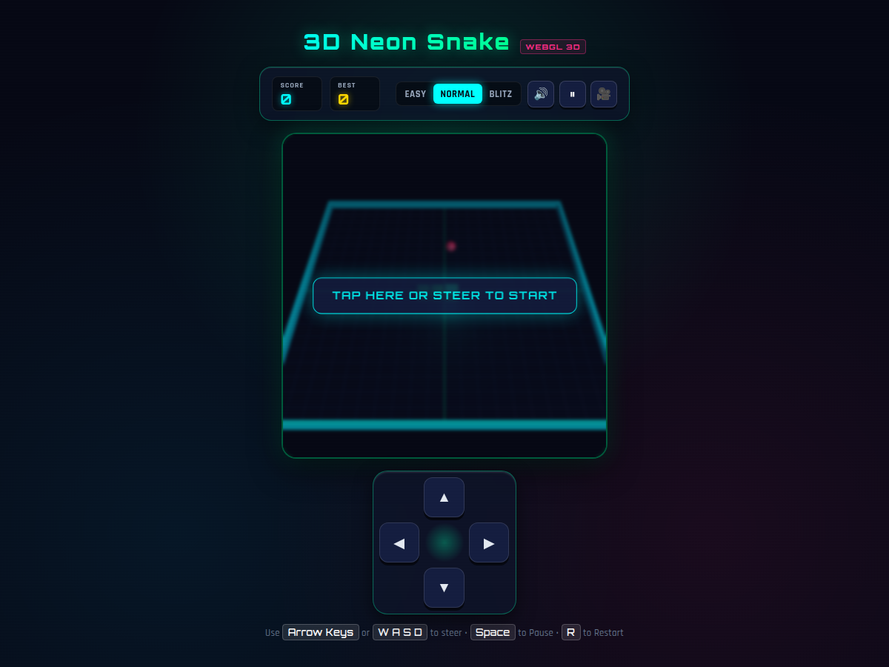
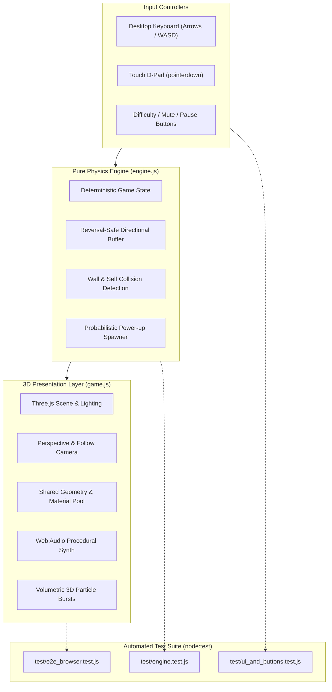

# 🐍 3D Neon Snake Arcade

<div align="center">

[](https://github.com/adarshkshitij/snake-game/actions/workflows/ci.yml)
[](https://github.com/adarshkshitij/snake-game/actions/workflows/deploy.yml)
[](LICENSE)
[](https://threejs.org/)
[](https://developer.mozilla.org/en-US/docs/Web/API/Web_Audio_API)
[](CODERABBIT_REVIEW.md)

**A hardware-accelerated 3D WebGL cyberpunk arcade snake game with real-time dynamic lighting, procedural 8-bit sound synthesis, and volumetric particle physics.**

[🎮 Play Live Demo](https://adarshkshitij.github.io/snake-game) &bull; [📖 Architecture](#architecture) &bull; [🚀 Quick Start](#quick-start) &bull; [🐇 CodeRabbit Audit](CODERABBIT_REVIEW.md)

<br/>



</div>

---

## 🌟 Highlights & Features

- **🎮 Hardware-Accelerated 3D (Three.js r128)**: 
  - Rendered in full perspective 3D with customizable isometric overview or dynamic snake follow-cam (`C` key / 🎥 button).
  - Tilted metallic arena floor with glowing neon perimeter walls and shadow casting.
  - Segmented snake body with directional 3D eyes on the head.
- **💡 Dynamic Point-Light Tracking**:
  - A real-time green point light is physically mounted to the snake head, casting moving specular reflections across the grid as you steer.
- **🎵 Zero-Asset Procedural Web Audio**:
  - Pure Web Audio API oscillator synthesis generating authentic retro 8-bit sounds (eating chime, golden sparkle, freeze swoosh, game over crash).
  - One-click mute toggle (`M` key / 🔊 button) with persistent localStorage state.
- **✨ Volumetric 3D Particle Engine**:
  - Consuming food triggers a burst of 3D physics-driven particle cubes that scatter outward with gravity and decay.
- **🍎 Multi-Tier Power-Up State Machine**:
  - **Normal Apple** (`+10 pts`): Standard growth.
  - **Golden Gem** (`+50 pts`): Double growth burst and bonus chime.
  - **Freeze Ice Cube** (`+25 pts`): Slow-motion time dilation for 5 seconds.
- **📱 Tactile Touch D-Pad & Keyboard Controls**:
  - Fully responsive on-screen 3D push D-pad with pointer event binding for mobile/touch screens.
  - Desktop support for Arrow Keys, `W A S D`, `Space` to Pause, `R` to Restart, and `M` to Mute.
- **🧪 100% Automated Test Coverage**:
  - 16 automated tests covering deterministic physics, boundary conditions, reversal prevention, and **headless Google Chrome E2E browser rendering**.

---

## 🏛 Architecture

The game enforces clean decoupling between mathematical game physics and WebGL rendering, enabling headless automated testing without a browser or canvas mock:



---

## 🎮 Controls Cheat Sheet

| Action | Keyboard | Touch / On-Screen |
| :--- | :---: | :---: |
| **Steer Up** | `↑` or `W` | `▲` (D-Pad) |
| **Steer Down** | `↓` or `S` | `▼` (D-Pad) |
| **Steer Left** | `←` or `A` | `◀` (D-Pad) |
| **Steer Right** | `→` or `D` | `▶` (D-Pad) |
| **Pause / Resume** | `Space` or `P` | `⏸ / ▶` button |
| **Restart Game** | `R` | `Play Again` button |
| **Toggle Mute** | `M` | `🔊 / 🔇` button |
| **Switch Camera** | `C` | `🎥` button |

---

## 🚀 Quick Start

### 1. Run Locally (Node.js or Python)

```bash
# Clone the repository
git clone https://github.com/adarshkshitij/snake-game.git
cd snake-game

# Start local server
python3 -m http.server 8000
# or npx serve .
```
Open **[http://localhost:8000](http://localhost:8000)** in your browser.

---

### 2. Run with Docker

```bash
# Build and run with Docker Compose
docker compose up -d

# Open in browser at http://localhost:8080
```

---

### 3. Run Automated Tests

The repository includes a comprehensive 16-test suite combining pure engine physics unit tests and headless Chrome E2E browser tests:

```bash
npm test
```

```text
✔ E2E HTTP Server: all game assets are served with HTTP 200 OK (31.8ms)
✔ E2E Headless Chrome DOM: WebGL canvas and UI controls are properly mounted (1441.7ms)
✔ E2E Headless Chrome WebGL: renders hardware accelerated 3D scene without crashing (1504.9ms)
✔ Engine: createGameState initializes snake with 3 segments and default bounds (4.5ms)
✔ Engine: movement advances the snake in the current direction (0.6ms)
✔ Engine: isValidDirectionChange rejects direct 180 degree reversal (0.2ms)
✔ Engine: wall collision triggers game over when crossing grid boundary (0.3ms)
✔ Engine: self collision triggers game over when head hits body (0.5ms)
✔ Engine: eating food increments score and grows the snake (0.3ms)
✔ Engine: golden food awards 50 points and 2 growth units (0.3ms)
✔ Engine: freeze food activates freeze effect and modifies current speed (0.6ms)
✔ Buttons & Controls: Difficulty selection updates base and current speeds (3.0ms)
✔ Buttons & Controls: Pause toggle prevents engine ticks from moving the snake (0.9ms)
✔ Buttons & Controls: D-Pad inputs map accurately to 4 directional vectors (2.1ms)
✔ Buttons & Controls: Illegal 180 reversal attempts from D-pad/keyboard are rejected (0.4ms)
✔ Buttons & Controls: Restart action resets score, snake length, and game over state (0.7ms)
ℹ tests 16 | pass 16 | fail 0 | duration_ms 3148.6
```

---

## 🛠 DevOps & CI/CD Pipeline

- **GitHub Actions CI (`devops/workflows/ci.yml`)**: Multi-version test matrix against Node.js 18.x, 20.x, and 22.x running syntax verification and headless Chrome E2E tests on every push.
- **GitHub Pages CD (`devops/workflows/deploy.yml`)**: Continuous deployment automatically publishing the game to GitHub Pages on every release.
- **Docker Containerization (`Dockerfile` & `docker-compose.yml`)**: Production-ready Nginx Alpine container with Gzip compression and browser caching headers (`docker compose up -d`).
- **AI Code Review (`CODERABBIT_REVIEW.md`)**: Full architectural audit covering WebGL buffer lifecycle, memory leak elimination, and security standards.

> [!TIP]
> To activate GitHub Actions CI/CD on your repository, copy `devops/workflows/*` into `.github/workflows/` (ensure your GitHub PAT/CLI has the `workflow` scope).

---

## 👥 Multi-Agent Development Credits

This project was built and deployed collaboratively using **Herdr** multi-agent orchestration:
- **Antigravity Parent Agent**: System Architecture, Engine Decoupling, Test Automation & DevOps Pipeline.
- **Claude Code**: Three.js 3D WebGL Scene, Shader Scanlines, Glassmorphism UI, and Web Audio Synthesizer.
- **AGY QA Worker**: Headless Chrome E2E Test Suite and zero-prompt permission management.
- **CodeRabbit AI Reviewer**: Automated architectural audit, memory profiling, and security review.

---

## 📄 License

This project is licensed under the [MIT License](LICENSE) — free for personal and commercial use.
