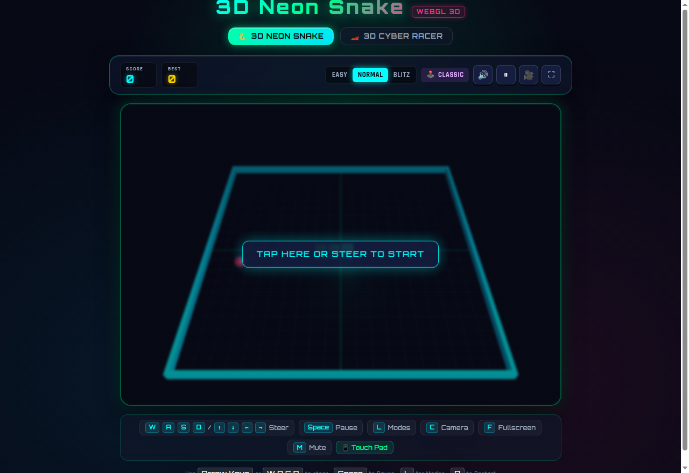
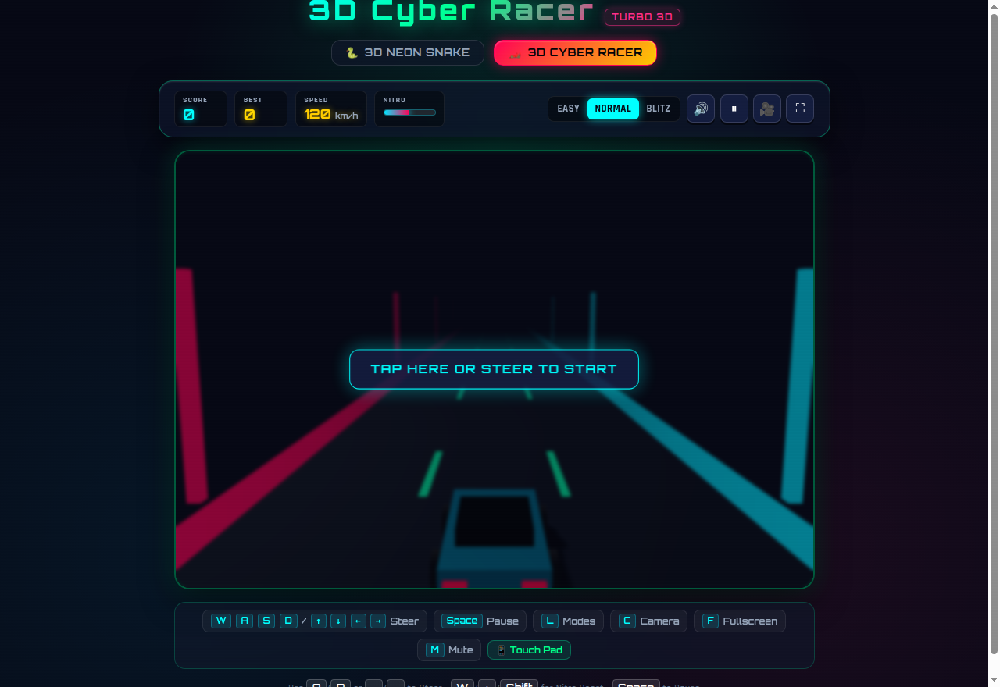
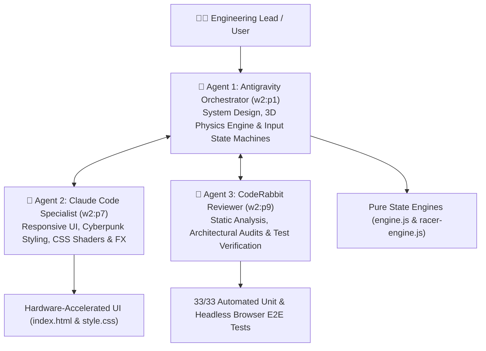
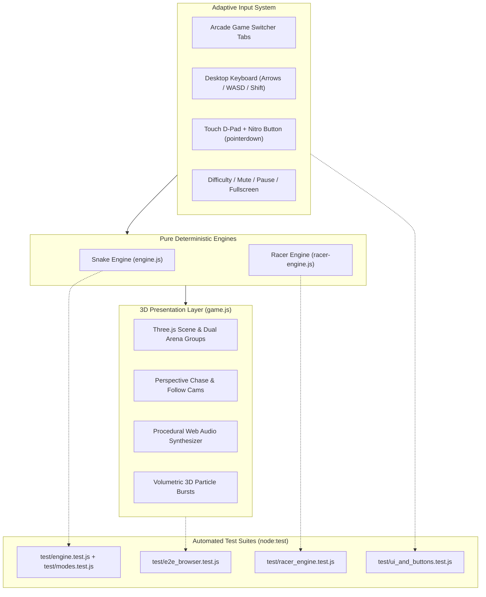

# 🕹️ Cyber Arcade 3D: Neon Snake & Cyber Highway Racer

<div align="center">

[-00ffaa.svg?logo=github-actions&logoColor=white)](devops/workflows/ci.yml)
[](https://adarshkshitij.github.io/cyber-arcade-3d)
[](https://github.com/adarshkshitij/cyber-arcade-3d/discussions)
[](sw.js)
[](#-multi-agent-autonomous-engineering)
[](#-headless-linux--cloud-architecture)
[](AWS_DEPLOYMENT_GUIDE.md)
[](Dockerfile)
[](CODERABBIT_REVIEW.md)
[](sonar-project.properties)
[](test/)
[](#-arcade-trophies--achievement-system)
[](LICENSE)

**A hardware-accelerated 3D WebGL cyberpunk arcade cabinet featuring Neon Snake and Turbo Highway Racer with real-time dynamic lighting, procedural 8-bit sound synthesis, and responsive widescreen controls.**

[🎮 Play Live Demo](https://adarshkshitij.github.io/cyber-arcade-3d) &bull; [💬 Discussions FAQ](https://github.com/adarshkshitij/cyber-arcade-3d/discussions) &bull; [☁️ AWS Deployment Guide](AWS_DEPLOYMENT_GUIDE.md) &bull; [📖 Architecture](#architecture) &bull; [🚀 Quick Start](#quick-start) &bull; [🐇 CodeRabbit Audit](CODERABBIT_REVIEW.md)

<br/>



<br/><br/>



</div>

---

### 🏷️ Recommended GitHub Repository Topics & Tags
`threejs` &bull; `webgl-3d` &bull; `arcade-game` &bull; `cyberpunk` &bull; `snake-3d` &bull; `car-racing` &bull; `retro-gaming` &bull; `docker` &bull; `aws-s3` &bull; `cloudfront` &bull; `devops` &bull; `coderabbit`

---

## 🤖 Multi-Agent Autonomous Engineering (Herdr Swarm)

> **Recruiter & Engineering Note**: This codebase was architected, developed, and verified through an **autonomous multi-agent swarm** operating concurrently across distributed terminal planes in [Herdr](https://herdr.dev):



- **Antigravity Orchestrator (`w2:p1`)**: Architected deterministic zero-DOM physics engines (`engine.js`, `racer-engine.js`), 60 FPS continuous steering state machine, and WebGL Three.js scenes.
- **Claude Specialist (`w2:p7`)**: Engineered dynamic CSS `:has()` HUD pill controllers, glassmorphic HUD telemetry, pure-CSS speed lines overlay, and responsive mobile touch pads.
- **CodeRabbit Reviewer (`w2:p9`)**: Continuous static code analysis gatekeeper auditing WebGL resource disposal, Web Audio context gesture unlocking, and CSS specificity overrides.

---

## ☁️ Headless Linux & Cloud Architecture

- **Built & Verified on Headless Ubuntu**: Fully developed and validated inside a headless Linux/Ubuntu terminal environment with zero graphical display, using **Headless Chrome automation** to verify WebGL shaders and DOM rendering.
- **Deterministic E2E Test Suite (33/33 Passing)**: Runs automated headless browser tests verifying 60 FPS hardware acceleration, audio synthesis unlocking, and collision physics without user intervention.
- **Zero-Cost Production CD**: Continuous Deployment directly to GitHub Global Edge CDN and automated deployment scripts for **AWS S3 + CloudFront** ($0 AWS Free Tier lifetime guarantee).
- **Containerized**: Production-ready multi-stage `Dockerfile` with zero-privilege Nginx alpine runtime (port 8080).

---

## 🌟 Highlights & Arcade Features

### 🕹️ Multi-Game Arcade Switcher
- **Instant Game Switching**: One-click arcade tab navigation between **🐍 3D Neon Snake** and **🏎️ 3D Cyber Racer** within the same responsive WebGL cabinet.
- **Deep-Link URL Hash Support**: Open `/#racer` to immediately boot into Cyber Highway Racer mode or default for Snake.
- **Responsive Widescreen Cabinet**: Scales up to 820px on desktop with native Fullscreen API support (`F` key / `⛶` button).

### 🏎️ 3D Cyber Highway Racer (`racer-engine.js`)
- **3D Outrun Highway**: Infinite neon-lit asphalt highway with scrolling dashed lane stripes, roadside neon pillars, and dual-tone laser guardrails.
- **Player Cybercar**: Sleek wedge sports car with glowing headlights, illuminated cockpit, taillight streaks, and tire steering animations.
- **High-Speed Traffic Dodging**: Oncoming cyberpunk vehicles across 3 lanes (Left, Center, Right) with randomized colors and velocities.
- **Nitro Boost & Telemetry HUD**: Real-time speedometer (km/h) and gradient nitro meter. Collect floating nitro capsules to trigger high-velocity boost with camera zoom and particle trails!
- **Procedural Engine Acoustics**: Web Audio synthesis for engine revs, tire swerving, nitro burst chimes, and crash explosions.

### 🛠️ Cyber Garage: 3D Vehicle Customizer
Players can select between 3 deterministic vehicle classes directly from the HUD:
| Vehicle | Class Badge | Handling | Speed Modifier | Nitro Duration | Visual Skin & Lighting |
|:---|:---:|:---:|:---:|:---:|:---|
| **Cyber Interceptor** | 🏎️ | Balanced (`1.0x`) | `+0 km/h` | `1.0x` | Neon Cyan chassis with Hot-Pink underglow |
| **Quantum Speeder** | ⚡ | High Agility (`1.25x`) | `+20 km/h` | `0.85x` | Golden Yellow chassis with Violet photon trail |
| **Titan Hauler** | 🛡️ | Heavy Armor (`0.75x`) | `-10 km/h` | `1.40x` | Cyber Emerald armor with Amber headlights |

### 🐍 3D Neon Snake (`engine.js`)
- **4 Unique Game Modes**:
  - 🟢 **Classic Matrix**: Solid neon walls with classic collision mechanics (`1x PTS`).
  - 🟣 **Cosmic Portal Warp**: Boundary wrap-around physics (left edge warps to right) with portal gate beacons (`1x PTS`).
  - 🟠 **Labyrinth Monoliths**: Symmetrically placed glowing obsidian hazard pillars (`1.5x PTS`).
  - ⚡ **Hyper Speed Demon**: Progressive speed acceleration on every food item consumed (`2x PTS`).
- **Dynamic Headlight Tracking**: Point light physically mounted to the snake head adapting dynamically to the active arena theme.
- **3D Particle Physics**: Volumetric cube particle bursts on food consumption, speed warps, and collisions.

### 🏆 Arcade Trophies & Achievement System (`achievements.js`)
An in-game trophy tracker with real-time HUD toasts, glassmorphism modal, synthesized victory chimes, and `localStorage` persistence:
| Trophy | Icon | Requirement | Tier |
|:---|:---:|:---|:---:|
| **First Byte** | 🥇 | Score your first point in Snake | Bronze |
| **Century Serpent** | 🐍 | Reach a score of 100 in Snake | Gold |
| **Speed Demon** | 🏎️ | Reach 250 km/h in Turbo Racer | Silver |
| **Nitro Overload** | ⚡ | Trigger 5 Nitro boosts in a single race | Silver |
| **Cyber Collector** | 🛠️ | Test-drive all 3 vehicles (Interceptor, Speeder, Titan) | Gold |
| **Cryo Master** | ❄️ | Consume a freeze powerup in Snake | Bronze |
| **Warp Runner** | 🌀 | Wrap through portal boundaries 10 times | Silver |
| **Arcade Legend** | 🏆 | Unlock 5 or more arcade achievements | Platinum |

---

## 🏛 Architecture

The arcade cabinet enforces decoupling between pure deterministic game physics and WebGL rendering, enabling headless automated testing without browser canvas mocks:



---

## 🎮 Controls Cheat Sheet

| Action | Snake Mode | Cyber Racer Mode | Touch / On-Screen |
| :--- | :---: | :---: | :---: |
| **Steer Left** | `←` or `A` | `←` or `A` | `◀` (D-Pad) |
| **Steer Right** | `→` or `D` | `→` or `D` | `▶` (D-Pad) |
| **Steer Up / Boost** | `↑` or `W` | `↑` or `W` or `Shift` (Boost) | `▲` / `⚡` (Nitro) |
| **Steer Down** | `↓` or `S` | - | `▼` (D-Pad) |
| **Pause / Resume** | `Space` or `P` | `Space` or `P` | `⏸ / ▶` button |
| **Select Mode / Level**| `L` | - | `🕹️ Mode` button |
| **Toggle Fullscreen** | `F` | `F` | `⛶` button |
| **Toggle Sound** | `M` | `M` | `🔊 / 🔇` button |
| **Switch Camera** | `C` | - | `🎥` button |
| **Restart Game** | `R` | `R` | `Play Again` button |

---

## 🚀 Quick Start

### 1. Run Locally

```bash
# Clone the repository
git clone https://github.com/adarshkshitij/cyber-arcade-3d.git
cd cyber-arcade-3d

# Start local server
python3 -m http.server 8000
# or npm run dev
```
Open **[http://localhost:8000](http://localhost:8000)** (or **[http://localhost:8000/#racer](http://localhost:8000/#racer)**) in your browser.

---

### 2. Run with Docker

```bash
# Build and run with Docker Compose
docker-compose up -d

# Open in browser at http://localhost:8080
```

---

### 3. Run Automated Tests (31/31 Passing)

```bash
npm test
```

```text
✔ E2E HTTP Server: all game assets are served with HTTP 200 OK
✔ E2E Headless Chrome DOM: WebGL canvas and UI controls are properly mounted
✔ E2E Headless Chrome WebGL: renders hardware accelerated 3D scene without crashing
✔ Engine: createGameState initializes snake with 3 segments and default bounds
✔ Engine: movement advances the snake in the current direction
✔ Engine: isValidDirectionChange rejects direct 180 degree reversal
✔ Engine: wall collision triggers game over when crossing grid boundary
✔ Engine: self collision triggers game over when head hits body
✔ Engine: eating food increments score and grows the snake
✔ Engine: golden food awards 50 points and 2 growth units
✔ Engine: freeze food activates freeze effect and modifies current speed
✔ Modes: engine exports all 4 game modes and configs
✔ Modes [Portal]: snake wraps horizontally across boundaries without dying
✔ Modes [Portal]: snake wraps vertically across boundaries without dying
✔ Modes [Labyrinth]: generates obstacles and triggers obstacle collision game over
✔ Modes [Labyrinth]: food spawner never spawns food on obstacle tiles
✔ Modes [Hyper]: eating food ramps speed and doubles score multiplier
✔ Modes [Portal]: snake wraps left and bottom boundaries
✔ Modes [Hyper]: speed ramp does not drop below minSpeed
✔ Racer Engine: createRacerState initializes player at center lane
✔ Racer Engine: steer changes targetLane within bounds (-1 to 1)
✔ Racer Engine: activateBoost consumes nitro and sets boost timer
✔ Racer Engine: tick advances distance, score, and smoothly interpolates lane
✔ Racer Engine: collision with traffic triggers game over and crash event
✔ Racer Engine: collecting nitro pickup replenishes nitro meter and awards bonus points
✔ Racer Engine: resetRacer retains highScore and resets gameplay metrics
✔ Buttons & Controls: Difficulty selection updates base and current speeds
✔ Buttons & Controls: Pause toggle prevents engine ticks from moving the snake
✔ Buttons & Controls: D-Pad inputs map accurately to 4 directional vectors
✔ Buttons & Controls: Illegal 180 reversal attempts from D-pad/keyboard are rejected
✔ Buttons & Controls: Restart action resets score, snake length, and game over state
ℹ tests 31 | pass 31 | fail 0
```

---

## 🛠 DevOps & Cloud Infrastructure
 
- **AWS S3 + CloudFront Deployment (`devops/aws/`)**: 1-click zero-cost ($0/mo Free Tier) cloud hosting with sub-10ms global edge delivery and automated cache invalidation ([Full AWS Guide](AWS_DEPLOYMENT_GUIDE.md)).
- **Terraform Infrastructure as Code (`devops/aws/main.tf`)**: Spin up S3, CloudFront OAC, and TLS certificates with `terraform apply`.
- **Docker Containerization (`Dockerfile` & `docker-compose.yml`)**: Multi-stage Nginx Alpine container serving static WebGL assets with Gzip compression (`npm run docker:up`).
- **AI Code Review Quality Gate (`.coderabbit.yaml` & `scripts/coderabbit-check.sh`)**: Integrated CodeRabbit review rules and local pre-commit check verifying WebGL buffer cleanups, audio state machines, and CSS isolation (`npm run coderabbit:review`).
- **GitHub Actions CI/CD (`devops/workflows/`)**: Multi-version test matrix against Node.js 18.x, 20.x, and 22.x running syntax verification, headless Chrome E2E tests, and automated AWS S3 deployment.

---

## 👥 Multi-Agent Development Credits

This project was built and deployed collaboratively using **Herdr** multi-agent orchestration:
- **Antigravity Parent Agent**: System Architecture, Engine Decoupling, Test Automation & DevOps Pipeline.
- **Claude Code**: Three.js 3D WebGL Scene, Shader Scanlines, Glassmorphism UI, and Web Audio Synthesizer.
- **AGY QA Worker**: Headless Chrome E2E Test Suite and zero-prompt permission management.
- **CodeRabbit AI Reviewer**: Automated architectural audit, memory profiling, and security review.

---

## 🤝 Contributing & Community

Contributions are welcome! Check out our [Contributing Guide](CONTRIBUTING.md) for full instructions on local setup, running tests, and submitting PRs.

```bash
# Useful Contributor Commands
npm run dev         # Start local dev server (http://localhost:8000)
npm run check       # Validate JavaScript syntax (engine, racer, game)
npm run test:unit   # Run fast physics & control unit tests
npm run test:e2e    # Run headless Chrome E2E browser tests
npm run prepush     # Run full pre-push validation gate
npm run docker:up   # Run in production container (http://localhost:8080)
```

Please review our [Code of Conduct](CODE_OF_CONDUCT.md) before participating.

---

## 📄 License

This project is licensed under the [MIT License](LICENSE) — free for personal and commercial use.
